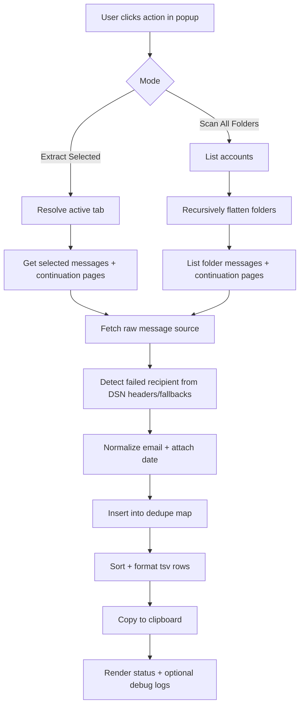

# Failed Recipient Extractor [Bounce Mail]

A Thunderbird MailExtension that extracts failed-recipient addresses from bounce/NDR messages into a deduplicated, clipboard-ready export for high-volume email operations.

[](manifest.json)
[](https://www.thunderbird.net/)
[](#testing)
[](LICENSE)
[](#testing)

> [!NOTE]
> This repository currently validates behavior via manual smoke tests inside Thunderbird (there is no automated CI pipeline committed yet).

## Table of Contents

- [Title and Description](#failed-recipient-extractor-bounce-mail)
- [Table of Contents](#table-of-contents)
- [Features](#features)
- [Tech Stack & Architecture](#tech-stack--architecture)
  - [Core Stack](#core-stack)
  - [Project Structure](#project-structure)
  - [Key Design Decisions](#key-design-decisions)
  - [Message Processing Pipeline](#message-processing-pipeline)
- [Getting Started](#getting-started)
  - [Prerequisites](#prerequisites)
  - [Installation](#installation)
- [Testing](#testing)
- [Deployment](#deployment)
- [Usage](#usage)
  - [From Selected Messages](#from-selected-messages)
  - [Full Mailbox Scan](#full-mailbox-scan)
  - [Program Flow Example](#program-flow-example)
- [Configuration](#configuration)
  - [Manifest Configuration](#manifest-configuration)
  - [Runtime Logic Configuration](#runtime-logic-configuration)
  - [Environment Variables](#environment-variables)
- [License](#license)
- [Contacts & Community Support](#contacts--community-support)

## Features

- Extracts failed recipients from selected Thunderbird messages in one click.
- Supports full-mailbox scanning across every configured account and folder.
- Parses multiple bounce patterns for robust hit-rate:
  - `X-Failed-Recipients`
  - `Final-Recipient`
  - `Original-Recipient`
  - Embedded `message/rfc822` fallback (`To:`)
  - Direct `To:` fallback with daemon/postmaster guardrails
- Detects probable bounce messages by sender heuristics (`mailer-daemon`, `postmaster`, `mail delivery`, etc.).
- Handles Thunderbird paginated message APIs (`messages.list`, `messages.continueList`, `mailTabs.getSelectedMessages`).
- Normalizes output by lowercasing, trimming, deduplicating, and deterministic sorting.
- Preserves message date metadata and outputs rows as `email<TAB>date`.
- Copies final payload directly to clipboard via `navigator.clipboard.writeText`.
- Provides on-demand hidden debug log panel in popup for diagnostic tracing.
- Ships as a lightweight, buildless extension (no bundler, no transpiler, no runtime dependency chain).

> [!TIP]
> Use **Extract Selected** for rapid triage and **Scan All Folders** for hygiene/audit sweeps.

## Tech Stack & Architecture

### Core Stack

- **Language:** JavaScript (ES6+)
- **UI:** HTML + CSS in `mainPopup/popup.html`
- **Extension Runtime:** Thunderbird MailExtension APIs (Manifest V2)
- **Packaging:** Raw extension directory + distributable `.xpi.zip` artifact
- **Primary Permissions:** `messagesRead`, `accountsRead`, `clipboardWrite`

### Project Structure

```text
.
├── manifest.json
├── mainPopup/
│   ├── popup.html
│   └── popup.js
├── icons/
│   ├── icon32.png
│   ├── icon48.png
│   └── icon128.png
├── Thunderbird_addon_Fail Mail.xpi.zip
├── CONTRIBUTING.md
├── LICENSE
└── README.md
```

### Key Design Decisions

- **Header-first extraction with fallback layers**
  - The parser attempts canonical DSN headers first, then progressively degrades to embedded and direct recipient headers.
  - This balances precision and recall for heterogeneous bounce formats.
- **Map-based uniqueness model**
  - A `Map<string, string>` stores `email -> date`, ensuring O(1) dedup checks and deterministic export after sort.
- **Two operational modes**
  - Selected-message processing for fast operator workflows.
  - Full recursive folder scan for compliance and list hygiene operations.
- **UI observability in constrained extension environments**
  - The hidden debug log offers runtime traceability without external logging infrastructure.
- **Buildless architecture**
  - Directly editable source lowers maintenance friction and simplifies enterprise-side code audits.

### Message Processing Pipeline



> [!IMPORTANT]
> Full-mailbox scanning can process large message volumes; expect longer runtime in large multi-account profiles.

## Getting Started

### Prerequisites

- Mozilla Thunderbird `102.0` or newer.
- At least one account/folder containing bounce or NDR messages.
- Git (optional, recommended for contributors).
- Node.js (optional, only for syntax-check command examples).

### Installation

1. Clone the repository.

```bash
git clone https://github.com/<your-org>/Failed-Recipient-Extractor-Bounce-Mail.git
cd Failed-Recipient-Extractor-Bounce-Mail
```

2. Load the extension temporarily in Thunderbird.

```text
Thunderbird -> Tools -> Add-ons and Themes -> Gear icon -> Debug Add-ons
Click "Load Temporary Add-on..." and choose `manifest.json`.
```

3. Verify the toolbar button appears as `Fail-mail`.

> [!WARNING]
> Temporary add-ons are removed on Thunderbird restart; reload `manifest.json` after each restart.

## Testing

This project currently uses manual validation in Thunderbird plus optional static syntax checks.

### Optional static checks

```bash
node --check mainPopup/popup.js
```

### Manual test checklist

1. Open a folder with known bounce/NDR messages.
2. Select a subset and click `Extract Selected`.
3. Confirm status summary and clipboard output format.
4. Click `Scan All Folders` and verify aggregate scan summary.
5. Toggle debug logs and inspect extraction traces and errors.

### Suggested contributor checks

```bash
# basic sanity
node --check mainPopup/popup.js

# package contents review before release
zipinfo -1 "Thunderbird_addon_Fail Mail.xpi.zip"
```

> [!CAUTION]
> Because tests are manual, parser changes should be validated against multiple bounce formats before release.

## Deployment

There is no committed CI/CD workflow in this repository; deployment is currently release-by-artifact.

### Recommended release flow

```bash
# 1) Update version metadata
# edit manifest.json -> version

# 2) Validate syntax
node --check mainPopup/popup.js

# 3) Build release package
zip -r "Failed-Recipient-Extractor-vX.Y.Z.xpi" manifest.json mainPopup icons LICENSE README.md
```

### Distribution strategies

- Publish signed artifacts through Thunderbird add-on channels.
- Side-load in controlled enterprise environments.
- Maintain changelog/release notes tied to manifest version increments.

### CI/CD integration guidance

If you introduce CI later, include at minimum:

- JavaScript syntax validation (`node --check`).
- Linting and formatting policy (if adopted).
- Artifact assembly job that verifies mandatory extension files.

## Usage

### From Selected Messages

1. In Thunderbird, select bounce or failed-delivery messages.
2. Open the extension popup.
3. Click `Extract Selected`.
4. Paste clipboard contents into your spreadsheet/CRM.

### Full Mailbox Scan

1. Open the popup.
2. Click `Scan All Folders`.
3. Wait for progress completion and summary output.
4. Paste deduplicated clipboard results into your target tool.

### Program Flow Example

```javascript
// User-triggered extraction pipeline (simplified)
const extractedData = new Map();

for (const msg of messages) {
  const raw = await browser.messages.getRaw(msg.id);       // load RFC822 source
  const email = findFailedRecipient(raw);                   // parse DSN/fallback headers
  if (!email) continue;

  const normalized = email.toLowerCase().trim();            // normalize key
  if (!extractedData.has(normalized)) {
    const date = msg.date ? new Date(msg.date).toLocaleDateString() : "No date";
    extractedData.set(normalized, date);                    // dedupe + retain date
  }
}

const tsv = Array.from(extractedData.entries())
  .sort((a, b) => a[0].localeCompare(b[0]))
  .map(([mail, date]) => `${mail}\t${date}`)
  .join("\n");

await navigator.clipboard.writeText(tsv);                   // export for operator workflow
```

## Configuration

### Manifest Configuration

Primary extension configuration is defined in `manifest.json`:

- `manifest_version`: extension manifest schema version.
- `name`, `description`, `version`: package identity and release metadata.
- `browser_specific_settings.gecko.strict_min_version`: minimum Thunderbird version.
- `permissions`: required runtime API permissions.
- `browser_action`: popup entrypoint and toolbar metadata.

### Runtime Logic Configuration

Behavioral tuning happens in `mainPopup/popup.js`:

- Bounce-recipient extraction regex and header matching order.
- Bounce-author heuristics for scan filtering.
- Output normalization and dedupe logic.
- UI status/debug message text.

### Environment Variables

This project does **not** use `.env` files or runtime environment variables by default.

If your organization needs policy-driven behavior, maintain a private fork and implement a configuration layer (e.g., JSON options file or managed defaults) before internal distribution.

## License

This project is licensed under **GPL-3.0**.
See [`LICENSE`](LICENSE) for full legal terms.

## Contacts & Community Support

## Support the Project

[](https://www.patreon.com/OstinFCT)
[](https://ko-fi.com/fctostin)
[](https://boosty.to/ostinfct)
[](https://www.youtube.com/@FCT-Ostin)
[](https://t.me/FCTostin)

If you find this tool useful, consider leaving a star on GitHub or supporting the author directly.
